# Unified Modeling Language (UML)

## 1. Use Case Diagram

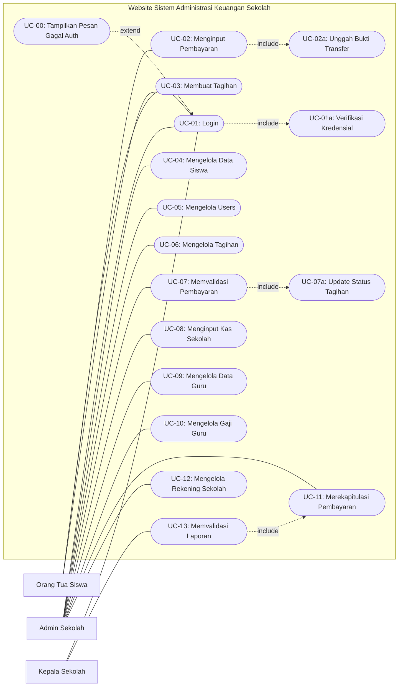
```mermaid
flowchart LR
    Actor_Ortu["Orang Tua Siswa"]
    Actor_Admin["Admin Sekolah"]
    Actor_Kepsek["Kepala Sekolah"]

    subgraph System ["Website Sistem Administrasi Keuangan Sekolah"]
        UC_Login(["UC-01: Login"])
        UC_InputBayar(["UC-02: Menginput Pembayaran"])
        UC_BuatTagihan(["UC-03: Membuat Tagihan"])
        UC_KelolaSiswa(["UC-04: Mengelola Data Siswa"])
        UC_KelolaUser(["UC-05: Mengelola Users"])
        UC_KelolaTagihan(["UC-06: Mengelola Tagihan"])
        UC_ValidasiBayar(["UC-07: Memvalidasi Pembayaran"])
        UC_InputKas(["UC-08: Menginput Kas Sekolah"])
        UC_KelolaGuru(["UC-09: Mengelola Data Guru"])
        UC_KelolaGaji(["UC-10: Mengelola Gaji Guru"])
        UC_RekapBayar(["UC-11: Merekapitulasi Pembayaran"])
        UC_KelolaRekening(["UC-12: Mengelola Rekening Sekolah"])
        UC_ValidasiLaporan(["UC-13: Memvalidasi Laporan"])

        UC_VerifikasiAuth(["UC-01a: Verifikasi Kredensial"])
        UC_UploadBukti(["UC-02a: Unggah Bukti Transfer"])
        UC_UpdateStatusTagihan(["UC-07a: Update Status Tagihan"])
        UC_ErrorAuth(["UC-00: Tampilkan Pesan Gagal Auth"])
    end

    Actor_Ortu --- UC_Login
    Actor_Ortu --- UC_InputBayar
    Actor_Ortu --- UC_BuatTagihan

    Actor_Admin --- UC_Login
    Actor_Admin --- UC_KelolaSiswa
    Actor_Admin --- UC_KelolaUser
    Actor_Admin --- UC_KelolaTagihan
    Actor_Admin --- UC_ValidasiBayar
    Actor_Admin --- UC_InputKas
    Actor_Admin --- UC_KelolaGuru
    Actor_Admin --- UC_KelolaGaji
    Actor_Admin --- UC_RekapBayar
    Actor_Admin --- UC_KelolaRekening

    Actor_Kepsek --- UC_Login
    Actor_Kepsek --- UC_ValidasiLaporan

    UC_Login -.->|include| UC_VerifikasiAuth
    UC_InputBayar -.->|include| UC_UploadBukti
    UC_ValidasiBayar -.->|include| UC_UpdateStatusTagihan
    UC_ValidasiLaporan -.->|include| UC_RekapBayar

    UC_ErrorAuth -.->|extend| UC_Login
```

---

## 2. Activity Diagram

### Orang Tua Siswa

#### Activity Diagram Login Orang Tua Siswa
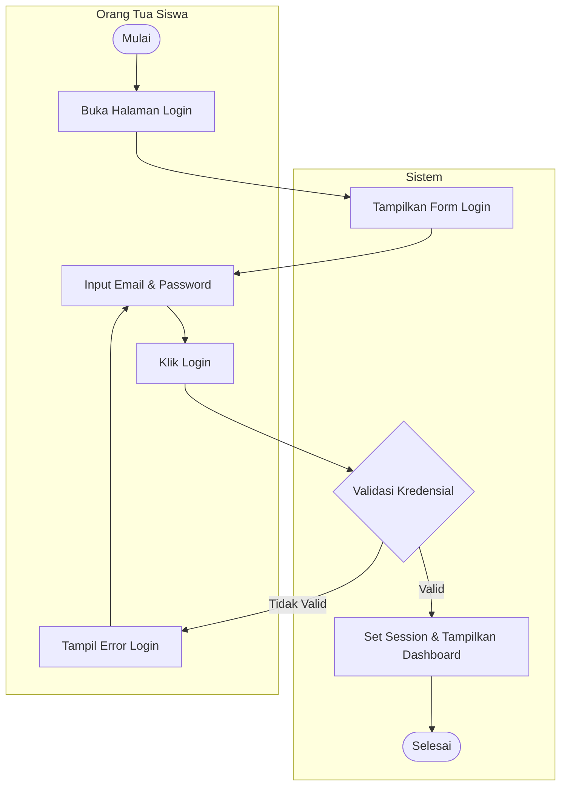
```mermaid
flowchart TD
    subgraph Sistem ["Sistem"]
        B1["Tampilkan Form Login"]
        B2{"Validasi Kredensial"}
        B3["Set Session & Tampilkan Dashboard"] --> B4([Selesai])
    end

    subgraph Ortu ["Orang Tua Siswa"]
        A1([Mulai]) --> A2["Buka Halaman Login"]
        A3["Input Email & Password"] --> A4["Klik Login"]
        A5["Tampil Error Login"] --> A3
    end

    A2 --> B1
    B1 --> A3
    A4 --> B2
    B2 -->|Tidak Valid| A5
    B2 -->|Valid| B3
```

#### Activity Diagram Menginput pembayaran
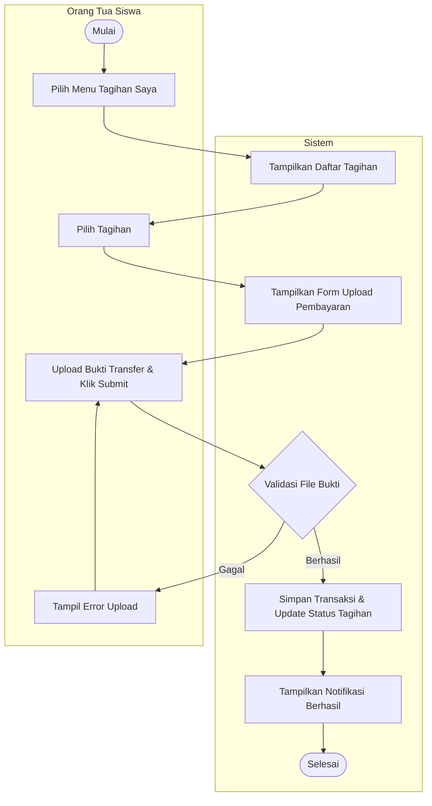
```mermaid
flowchart TD
    subgraph Sistem ["Sistem"]
        B1["Tampilkan Daftar Tagihan"]
        B2["Tampilkan Form Upload Pembayaran"]
        B3{"Validasi File Bukti"}
        B4["Simpan Transaksi & Update Status Tagihan"]
        B5["Tampilkan Notifikasi Berhasil"] --> B6([Selesai])
    end

    subgraph Ortu ["Orang Tua Siswa"]
        A1([Mulai]) --> A2["Pilih Menu Tagihan Saya"]
        A3["Pilih Tagihan"]
        A4["Upload Bukti Transfer & Klik Submit"]
        A5["Tampil Error Upload"] --> A4
    end

    A2 --> B1
    B1 --> A3
    A3 --> B2
    B2 --> A4
    A4 --> B3
    B3 -->|Gagal| A5
    B3 -->|Berhasil| B4
    B4 --> B5
```

#### Activity Diagram Membuat tagihan
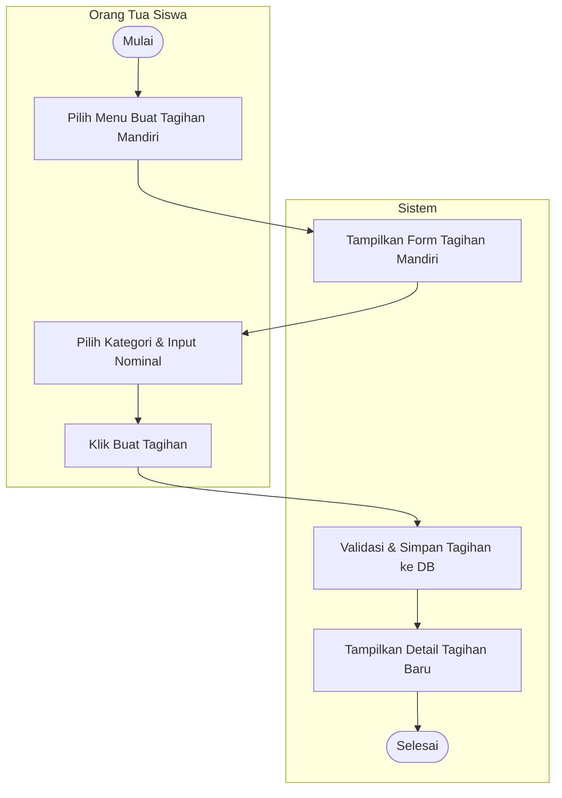
```mermaid
flowchart TD
    subgraph Sistem ["Sistem"]
        B1["Tampilkan Form Tagihan Mandiri"]
        B2["Validasi & Simpan Tagihan ke DB"]
        B3["Tampilkan Detail Tagihan Baru"] --> B4([Selesai])
    end

    subgraph Ortu ["Orang Tua Siswa"]
        A1([Mulai]) --> A2["Pilih Menu Buat Tagihan Mandiri"]
        A3["Pilih Kategori & Input Nominal"] --> A4["Klik Buat Tagihan"]
    end

    A2 --> B1
    B1 --> A3
    A4 --> B2
    B2 --> B3
```

---

### Admin Sekolah

#### Activity Diagram Login Admin Sekolah
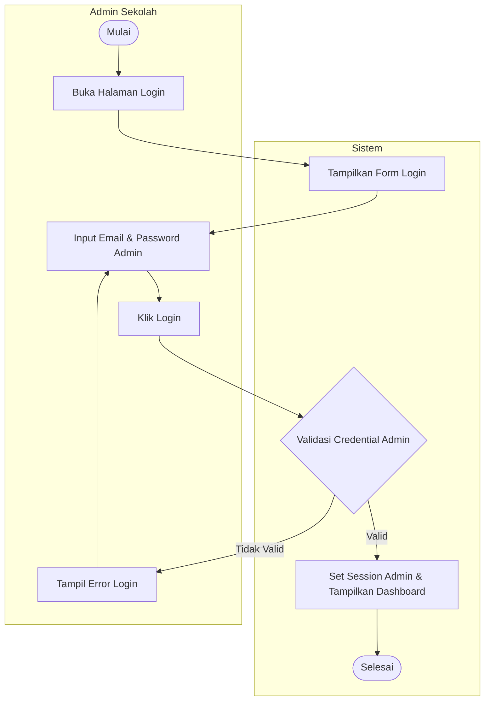
```mermaid
flowchart TD
    subgraph Sistem ["Sistem"]
        B1["Tampilkan Form Login"]
        B2{"Validasi Credential Admin"}
        B3["Set Session Admin & Tampilkan Dashboard"] --> B4([Selesai])
    end

    subgraph Admin ["Admin Sekolah"]
        A1([Mulai]) --> A2["Buka Halaman Login"]
        A3["Input Email & Password Admin"] --> A4["Klik Login"]
        A5["Tampil Error Login"] --> A3
    end

    A2 --> B1
    B1 --> A3
    A4 --> B2
    B2 -->|Tidak Valid| A5
    B2 -->|Valid| B3
```

#### Activity Diagram Mengelola data siswa

```mermaid
flowchart TD
    subgraph Sistem ["Sistem"]
        B1["Tampilkan Daftar Siswa & Tombol Aksi"]
        B2["Simpan / Update Data Siswa ke DB"]
        B3["Hapus Data Siswa dari DB"]
        B4["Tampilkan Notifikasi Sukses"] --> B5([Selesai])
    end

    subgraph Admin ["Admin Sekolah"]
        A1([Mulai]) --> A2["Pilih Menu Data Siswa"]
        A3{"Pilih Aksi"}
        A4["Input Form Data Siswa"] --> A6["Klik Simpan"]
        A5["Konfirmasi Hapus Siswa"]
    end

    A2 --> B1
    B1 --> A3
    A3 -->|Tambah / Edit| A4
    A3 -->|Hapus| A5
    A6 --> B2
    A5 --> B3
    B2 --> B4
    B3 --> B4
```

#### Activity Diagram Mengelola users
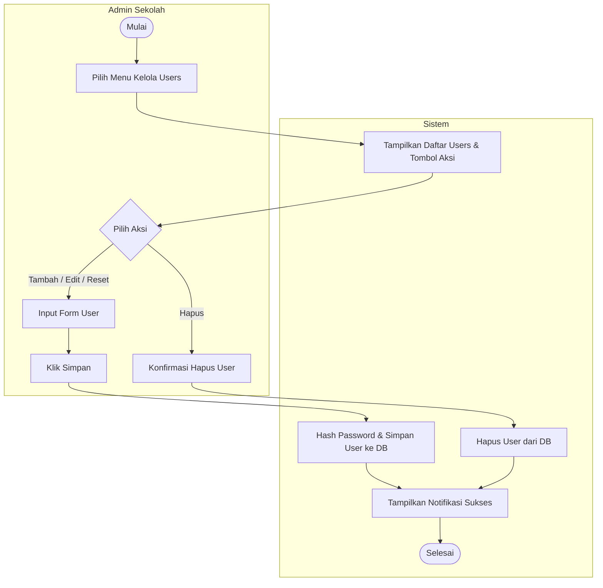
```mermaid
flowchart TD
    subgraph Sistem ["Sistem"]
        B1["Tampilkan Daftar Users & Tombol Aksi"]
        B2["Hash Password & Simpan User ke DB"]
        B3["Hapus User dari DB"]
        B4["Tampilkan Notifikasi Sukses"] --> B5([Selesai])
    end

    subgraph Admin ["Admin Sekolah"]
        A1([Mulai]) --> A2["Pilih Menu Kelola Users"]
        A3{"Pilih Aksi"}
        A4["Input Form User"] --> A6["Klik Simpan"]
        A5["Konfirmasi Hapus User"]
    end

    A2 --> B1
    B1 --> A3
    A3 -->|Tambah / Edit / Reset| A4
    A3 -->|Hapus| A5
    A6 --> B2
    A5 --> B3
    B2 --> B4
    B3 --> B4
```

#### Activity Diagram Mengelola tagihan
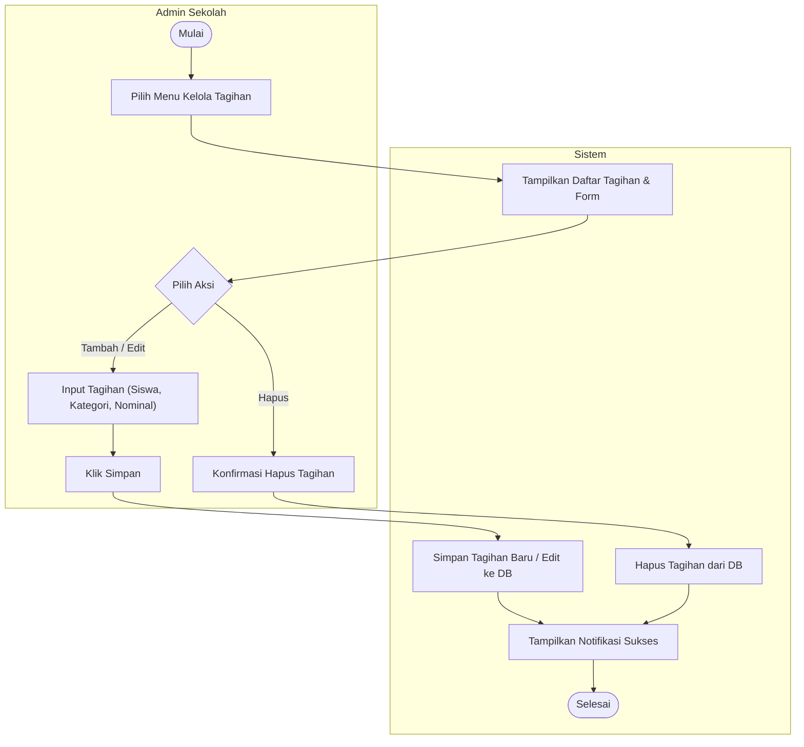
```mermaid
flowchart TD
    subgraph Sistem ["Sistem"]
        B1["Tampilkan Daftar Tagihan & Form"]
        B2["Simpan Tagihan Baru / Edit ke DB"]
        B3["Hapus Tagihan dari DB"]
        B4["Tampilkan Notifikasi Sukses"] --> B5([Selesai])
    end

    subgraph Admin ["Admin Sekolah"]
        A1([Mulai]) --> A2["Pilih Menu Kelola Tagihan"]
        A3{"Pilih Aksi"}
        A4["Input Tagihan (Siswa, Kategori, Nominal)"] --> A6["Klik Simpan"]
        A5["Konfirmasi Hapus Tagihan"]
    end

    A2 --> B1
    B1 --> A3
    A3 -->|Tambah / Edit| A4
    A3 -->|Hapus| A5
    A6 --> B2
    A5 --> B3
    B2 --> B4
    B3 --> B4
```

#### Activity Diagram Memvalidasi pembayaran
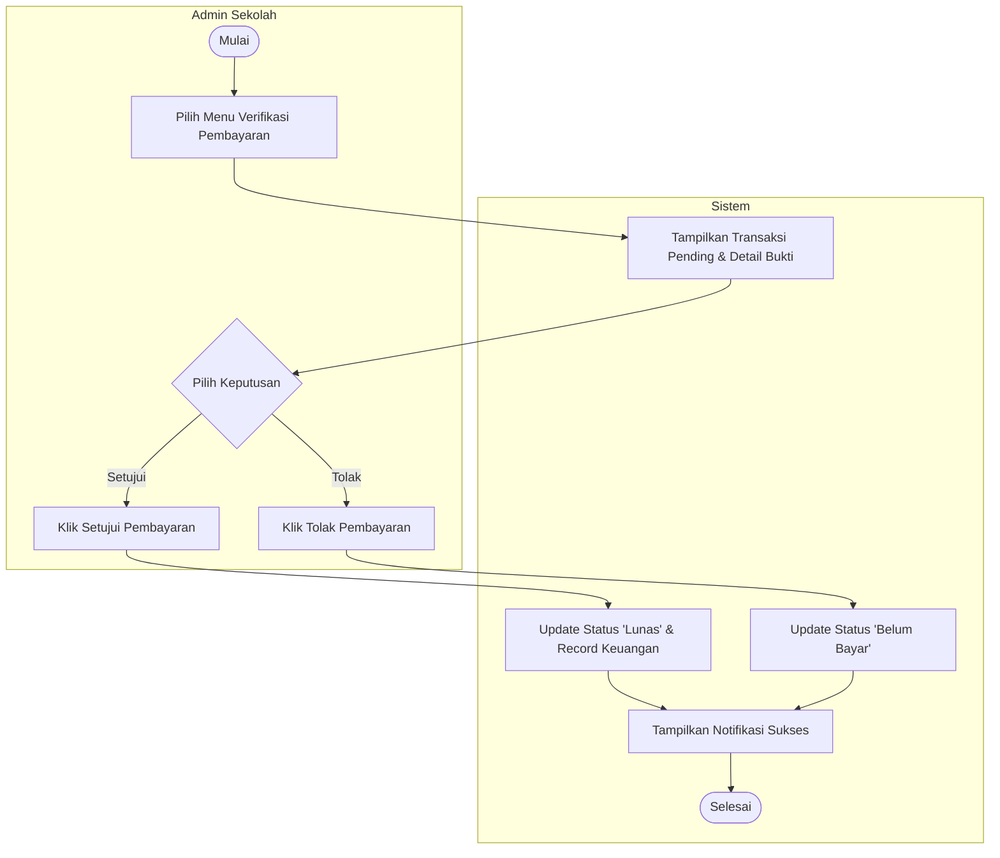
```mermaid
flowchart TD
    subgraph Sistem ["Sistem"]
        B1["Tampilkan Transaksi Pending & Detail Bukti"]
        B2["Update Status 'Lunas' & Record Keuangan"]
        B3["Update Status 'Belum Bayar'"]
        B4["Tampilkan Notifikasi Sukses"] --> B5([Selesai])
    end

    subgraph Admin ["Admin Sekolah"]
        A1([Mulai]) --> A2["Pilih Menu Verifikasi Pembayaran"]
        A3{"Pilih Keputusan"}
        A4["Klik Setujui Pembayaran"]
        A5["Klik Tolak Pembayaran"]
    end

    A2 --> B1
    B1 --> A3
    A3 -->|Setujui| A4
    A3 -->|Tolak| A5
    A4 --> B2
    A5 --> B3
    B2 --> B4
    B3 --> B4
```

#### Activity Diagram Menginput Kas Sekolah
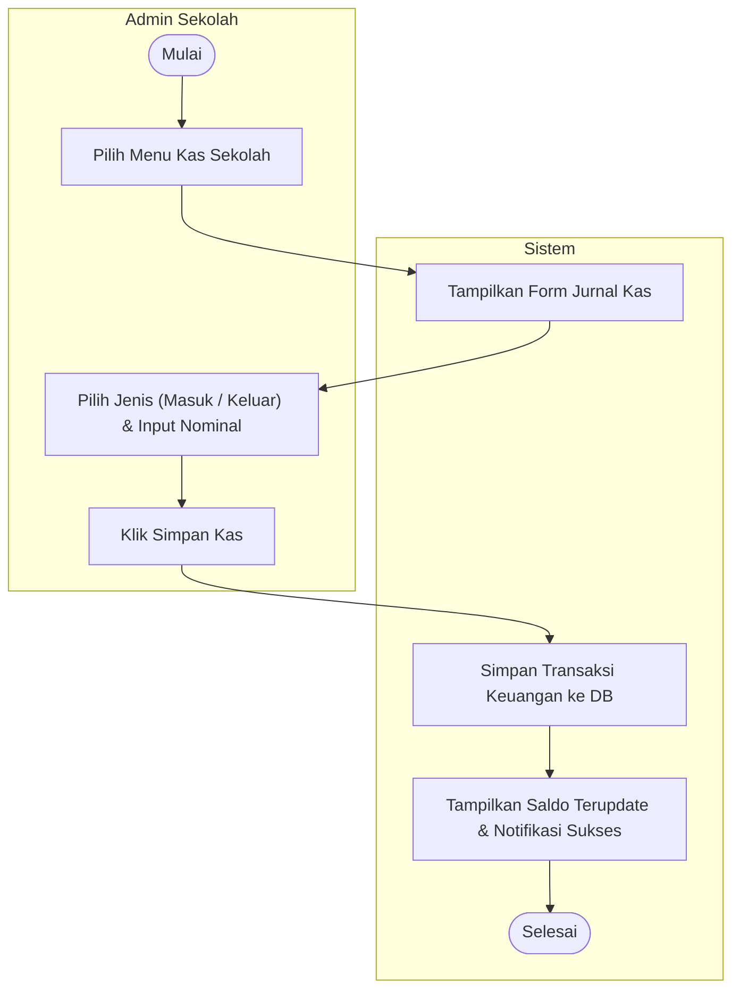
```mermaid
flowchart TD
    subgraph Sistem ["Sistem"]
        B1["Tampilkan Form Jurnal Kas"]
        B2["Simpan Transaksi Keuangan ke DB"]
        B3["Tampilkan Saldo Terupdate & Notifikasi Sukses"] --> B4([Selesai])
    end

    subgraph Admin ["Admin Sekolah"]
        A1([Mulai]) --> A2["Pilih Menu Kas Sekolah"]
        A3["Pilih Jenis (Masuk / Keluar) & Input Nominal"] --> A4["Klik Simpan Kas"]
    end

    A2 --> B1
    B1 --> A3
    A4 --> B2
    B2 --> B3
```

#### Activity Diagram Mengelola data guru
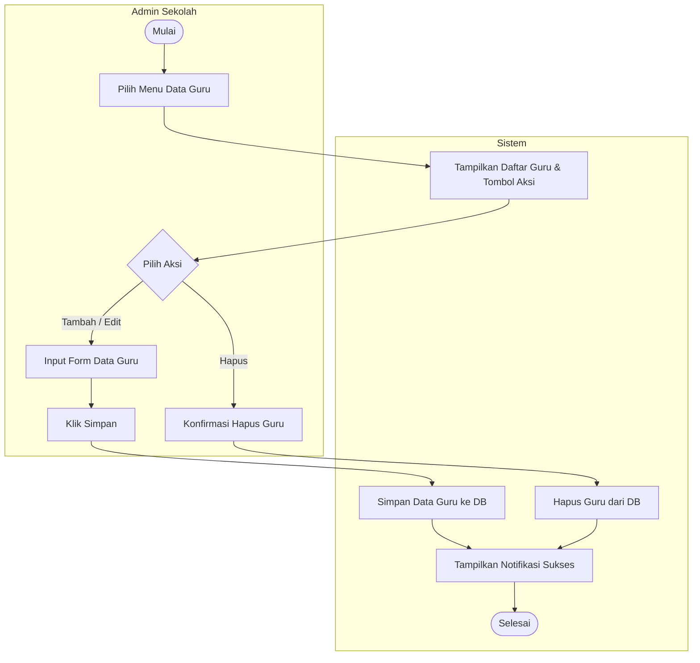
```mermaid
flowchart TD
    subgraph Sistem ["Sistem"]
        B1["Tampilkan Daftar Guru & Tombol Aksi"]
        B2["Simpan Data Guru ke DB"]
        B3["Hapus Guru dari DB"]
        B4["Tampilkan Notifikasi Sukses"] --> B5([Selesai])
    end

    subgraph Admin ["Admin Sekolah"]
        A1([Mulai]) --> A2["Pilih Menu Data Guru"]
        A3{"Pilih Aksi"}
        A4["Input Form Data Guru"] --> A6["Klik Simpan"]
        A5["Konfirmasi Hapus Guru"]
    end

    A2 --> B1
    B1 --> A3
    A3 -->|Tambah / Edit| A4
    A3 -->|Hapus| A5
    A6 --> B2
    A5 --> B3
    B2 --> B4
    B3 --> B4
```

#### Activity Diagram Mengelola gaji guru
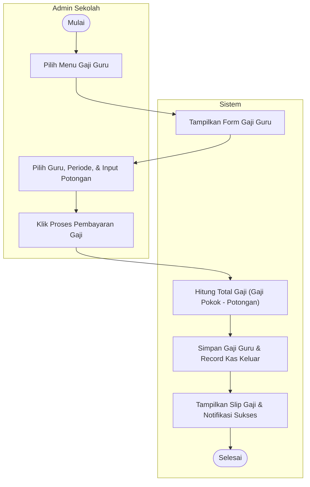
```mermaid
flowchart TD
    subgraph Sistem ["Sistem"]
        B1["Tampilkan Form Gaji Guru"]
        B2["Hitung Total Gaji (Gaji Pokok - Potongan)"]
        B3["Simpan Gaji Guru & Record Kas Keluar"]
        B4["Tampilkan Slip Gaji & Notifikasi Sukses"] --> B5([Selesai])
    end

    subgraph Admin ["Admin Sekolah"]
        A1([Mulai]) --> A2["Pilih Menu Gaji Guru"]
        A3["Pilih Guru, Periode, & Input Potongan"] --> A4["Klik Proses Pembayaran Gaji"]
    end

    A2 --> B1
    B1 --> A3
    A4 --> B2
    B2 --> B3
    B3 --> B4
```

#### Activity Diagram Merekapitulasi pembyaran
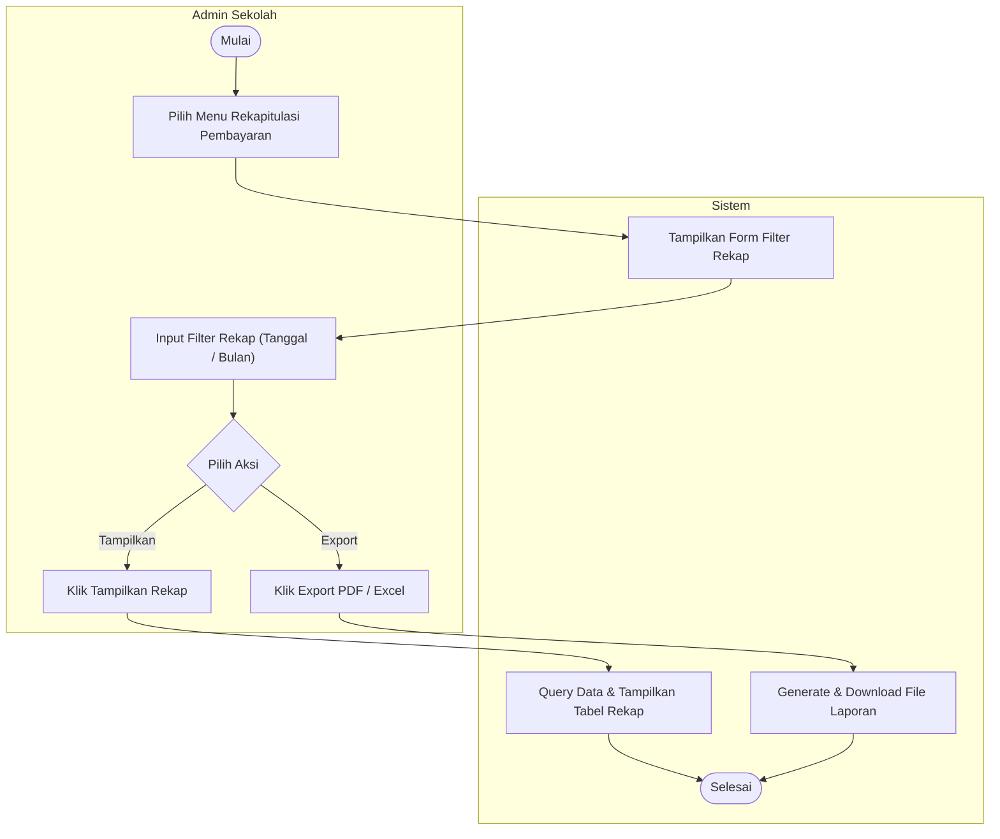
```mermaid
flowchart TD
    subgraph Sistem ["Sistem"]
        B1["Tampilkan Form Filter Rekap"]
        B2["Query Data & Tampilkan Tabel Rekap"] --> B4([Selesai])
        B3["Generate & Download File Laporan"] --> B4
    end

    subgraph Admin ["Admin Sekolah"]
        A1([Mulai]) --> A2["Pilih Menu Rekapitulasi Pembayaran"]
        A3["Input Filter Rekap (Tanggal / Bulan)"] --> A4{"Pilih Aksi"}
        A5["Klik Tampilkan Rekap"]
        A6["Klik Export PDF / Excel"]
    end

    A2 --> B1
    B1 --> A3
    A4 -->|Tampilkan| A5
    A4 -->|Export| A6
    A5 --> B2
    A6 --> B3
```

#### Activity Diagram Mengelola rekening sekolah
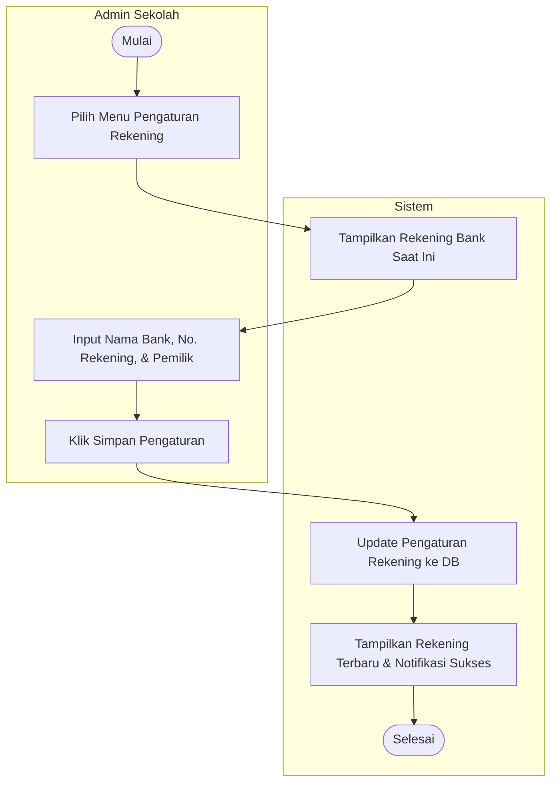
```mermaid
flowchart TD
    subgraph Sistem ["Sistem"]
        B1["Tampilkan Rekening Bank Saat Ini"]
        B2["Update Pengaturan Rekening ke DB"]
        B3["Tampilkan Rekening Terbaru & Notifikasi Sukses"] --> B4([Selesai])
    end

    subgraph Admin ["Admin Sekolah"]
        A1([Mulai]) --> A2["Pilih Menu Pengaturan Rekening"]
        A3["Input Nama Bank, No. Rekening, & Pemilik"] --> A4["Klik Simpan Pengaturan"]
    end

    A2 --> B1
    B1 --> A3
    A4 --> B2
    B2 --> B3
```

---

### Kepala Sekolah

#### Activity Diagram Login Kepala Sekolah
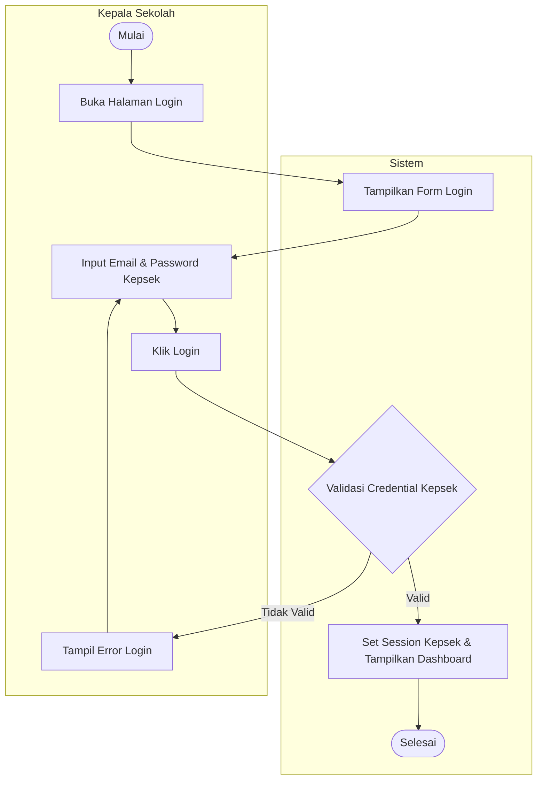
```mermaid
flowchart TD
    subgraph Sistem ["Sistem"]
        B1["Tampilkan Form Login"]
        B2{"Validasi Credential Kepsek"}
        B3["Set Session Kepsek & Tampilkan Dashboard"] --> B4([Selesai])
    end

    subgraph Kepsek ["Kepala Sekolah"]
        A1([Mulai]) --> A2["Buka Halaman Login"]
        A3["Input Email & Password Kepsek"] --> A4["Klik Login"]
        A5["Tampil Error Login"] --> A3
    end

    A2 --> B1
    B1 --> A3
    A4 --> B2
    B2 -->|Tidak Valid| A5
    B2 -->|Valid| B3
```

#### Activity Diagram Memvalidasi laporan
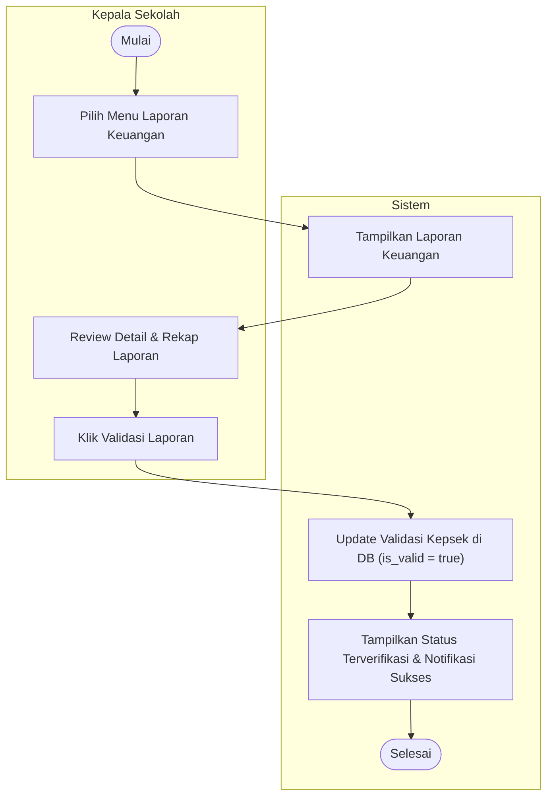
```mermaid
flowchart TD
    subgraph Sistem ["Sistem"]
        B1["Tampilkan Laporan Keuangan"]
        B2["Update Validasi Kepsek di DB (is_valid = true)"]
        B3["Tampilkan Status Terverifikasi & Notifikasi Sukses"] --> B4([Selesai])
    end

    subgraph Kepsek ["Kepala Sekolah"]
        A1([Mulai]) --> A2["Pilih Menu Laporan Keuangan"]
        A3["Review Detail & Rekap Laporan"] --> A4["Klik Validasi Laporan"]
    end

    A2 --> B1
    B1 --> A3
    A4 --> B2
    B2 --> B3
```

---

## 3. Class Diagram

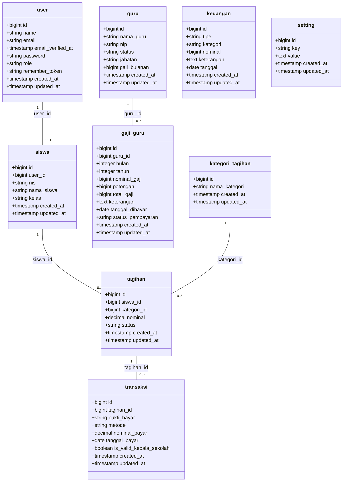
```mermaid
classDiagram
    class user {
        +bigint id
        +string name
        +string email
        +timestamp email_verified_at
        +string password
        +string role
        +string remember_token
        +timestamp created_at
        +timestamp updated_at
    }

    class siswa {
        +bigint id
        +bigint user_id
        +string nis
        +string nama_siswa
        +string kelas
        +timestamp created_at
        +timestamp updated_at
    }

    class guru {
        +bigint id
        +string nama_guru
        +string nip
        +string status
        +string jabatan
        +bigint gaji_bulanan
        +timestamp created_at
        +timestamp updated_at
    }

    class gaji_guru {
        +bigint id
        +bigint guru_id
        +integer bulan
        +integer tahun
        +bigint nominal_gaji
        +bigint potongan
        +bigint total_gaji
        +text keterangan
        +date tanggal_dibayar
        +string status_pembayaran
        +timestamp created_at
        +timestamp updated_at
    }

    class kategori_tagihan {
        +bigint id
        +string nama_kategori
        +timestamp created_at
        +timestamp updated_at
    }

    class tagihan {
        +bigint id
        +bigint siswa_id
        +bigint kategori_id
        +decimal nominal
        +string status
        +timestamp created_at
        +timestamp updated_at
    }

    class transaksi {
        +bigint id
        +bigint tagihan_id
        +string bukti_bayar
        +string metode
        +decimal nominal_bayar
        +date tanggal_bayar
        +boolean is_valid_kepala_sekolah
        +timestamp created_at
        +timestamp updated_at
    }

    class keuangan {
        +bigint id
        +string tipe
        +string kategori
        +bigint nominal
        +text keterangan
        +date tanggal
        +timestamp created_at
        +timestamp updated_at
    }

    class setting {
        +bigint id
        +string key
        +text value
        +timestamp created_at
        +timestamp updated_at
    }

    user "1" -- "0..1" siswa : user_id
    siswa "1" -- "0..*" tagihan : siswa_id
    kategori_tagihan "1" -- "0..*" tagihan : kategori_id
    tagihan "1" -- "0..*" transaksi : tagihan_id
    guru "1" -- "0..*" gaji_guru : guru_id
```
